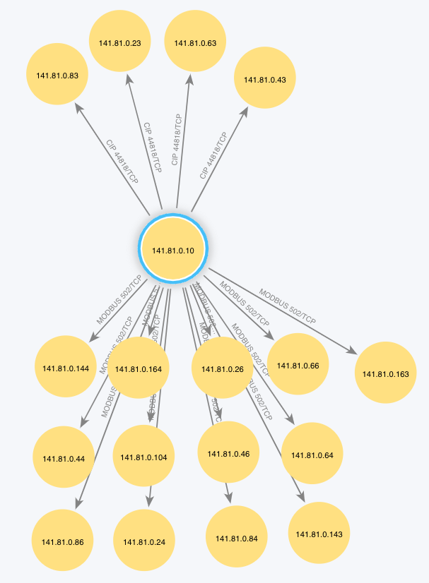

# ICS Packet Capture Visualizer
A packet capture visualizer for industrial control networks. This project takes a network packet capture file (PCAP), processes the packets using `pyshark`, and sends information about the traffic to a Neo4j database. The Neo4j browsers and tools can be used to visualize and interact with the network information collected from the PCAP.

Visualization of network communications provides with the development and review of network and data flow diagrams. This tool uses the local network traffic to generate these diagrams while also providing details about the true nature of communications. Visualizing the network traffic can help identify instances of `shadow`, or even rogue, systems and devices.

IMPORTANT NOTE: You will need to learn how to use Neo4j to manually process this information. Populating the database is only the first step. There is more work once the script has completed. Don't be scared.

# Usage
## Processing Examples
### Graph TCP traffic only
```
┌──CUTSEC - 22-09-09 17:54:20
└─$ ./icsPcapViz.py -f ./Plant1.pcap
```
### Graph TCP and UDP traffic
```
┌──CUTSEC - 22-09-09 17:56:40
└─$ ./icsPcapViz.py -f ./Plant1.pcap -u
```

### Graph UDP traffic only
```
┌──CUTSEC - 22-09-09 17:59:23
└─$ ./icsPcapViz.py -f ./Plant1.pcap -t -u
```
### Neo4j Bloom Graph

**NOTE: These nodes were manually organized.**

## Install and Review Neo4j documentation
* Install Neo4j: https://neo4j.com/docs/operations-manual/current/installation/
* Neo4j Quick Start: https://neo4j.com/developer/get-started/
* Neo4j Bloom Quick Start: https://neo4j.com/docs/bloom-user-guide/current/bloom-quick-start/

## Start a Neo4j Project and Database
* Stop any running databases.
* Create a new project and name the project 'ICSPcapViz' or something related to your task.
* Add a new database and name it 'ICSPcapViz' or something related to your task.
  * When prompted set the password to 'admin' (the ICSPcapViz default) or you will need to proved the password to the script.
* Start database.
* Open the Neo4j browser for the database.
* Create a script to clear the database, see below. - you may do several runs, this script will help.

### Clear Neo4j Database Script
```
// Clean DB
// Remove all node relationships
Match (n) -[r] -> () delete n,r;
// Remove all remaining nodes
Match (n) delete n;
```
## Populating and Using Database
* Run the 'ICSPcapViz' script
* Check database contents using the Neo4j browser with the query `MATCH (n) RETURN n`
* Use the Neo4j Bloom browser to review the data
  * Select `HOST---HOST`
  * Move nodes around
  * Search for specific nodes or relationships
  * Export data
  * Export an image (visualize) the network

## Help Message
```
./icsPcapViz.py [-h] [-d] [-n int] [-l int] [-s int] [-m] [-M list] [-e] [-z] [-f <binary file>]
    -h: This is it.
    -d: Turn on debugging.  Default: off
    -f <pcap>: pcap file that contains the data. Required
    -p: <passwd>: Neo4J password Default: admin. Yes, this will be in your shell history.
    -t: Process TC) packets. Default: True
    -u: Process UDP packets. Default: False
    -i: Process ICMP packets. Default: False [NOT IMPLEMENTED]
    -a: Process ARP packets. Default: False [NOT IMPLEMENTED]
    -w: Process Windows packets. Default: False
    -e: Disable ignoring packets based on protocol and ports. Default: False
        Warning, some packets are ignored to improve data flow representations.

Be sure to start your Neo4J database. Read README for guideance.

Processing PCAPs can take time. Be patient.
Yes, you can write a progress bar and submit a pull request.
```

# Installation

* Clone repository
* Change directory into the repository
* Install requirements using `pip install -r requirements.txt`
  * [pyshark](https://pypi.org/project/pyshark/) 
  * [py2neo](https://pypi.org/project/py2neo/) 

# TODO
* Include additional industrial protocols in the expected ports and protocols variables
* Add property information to the nodes to include data like interface hardware addresses and vendors
* Colorize nodes to help with display in Neo4j browser
* Determine if nodes can be automatically organized by Neo4j browser
* Add ICMP processing
* Add ARP processing

# Recognition

Thank you to the following people for their help, input, and testing.

* CutSec Discord
* Tom Liston
* John H. Sawyer

# Similar Projects
* [multiplex3r/loadPcap.py](https://gist.github.com/multiplex3r/a04a8cfc1dcedb2e5553ff7c850c9450) - great starting point using SCAPY
* [NetFrenzy](https://github.com/CoalfireFederal/NetFrenzy)
* [Packet Communication Investigator](https://github.com/michoo/pci)
* [PCAP Visualization Tool](https://github.com/Sh3lldor/PVT)